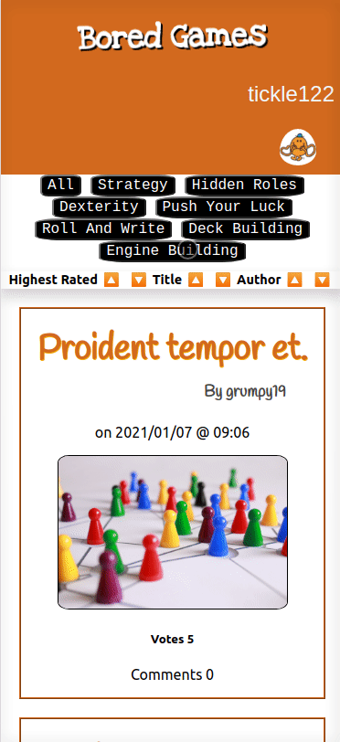

<h1 align="center">👋 Welcome to bored-games 👋</h1>
<p>
  
</p>


> A simple react frontend application to counterpart the mock API I created as part of the Northcoders Bootcamp.

### [Link to Hosted Application](https://bored-games-r-us.netlify.app/)

## Install

```sh
npm install
```

> To get all the required dependencies

## Run on local

```sh
npm run start
```

> To open a locally hosted version of the App

## Build

```sh
npm run build
```

> To create build version ready for deployment

## Run tests

```sh
npm run test
```

> To test my wonderful util functions..

## The Tech

_For this project I have used_

- React
- React Router
- Axios
- An API I previously created with Node.js

## The App

Opening the App will direct you to the homepage where you can filter out game reviews using the categories provided.


The sort bar can currently sort the reviews by Highest Rated, Title and Author name in Ascending and Descending order.



Clicking on the Title of one of the review cards will take you to its own page where you can view the body of the review, Upvote the review and also view any comments that may be attached to it.


Writing you own comment is easy as you can just type what you want in the comment form and it shall be posted just like that, as the default logged in user.


## Author

👤 **AJLud**

- Website: https://ajlud.github.io/alex-ludlow-portfolio/
- Github: [@AJLud](https://github.com/AJLud)
- LinkedIn: [@https:\/\/www.linkedin.com\/in\/alex-ludlow-b97359211\/](https://linkedin.com/in/https://www.linkedin.com/in/alex-ludlow-b97359211/)

## Show your support

This is my first real react project and I am very happy at what I have learnt over the past two weeks and I can't wait to make more in in the future!

Give a ⭐️ if this project helped you!

---

_This README was generated with ❤️ by [readme-md-generator](https://github.com/kefranabg/readme-md-generator)_
